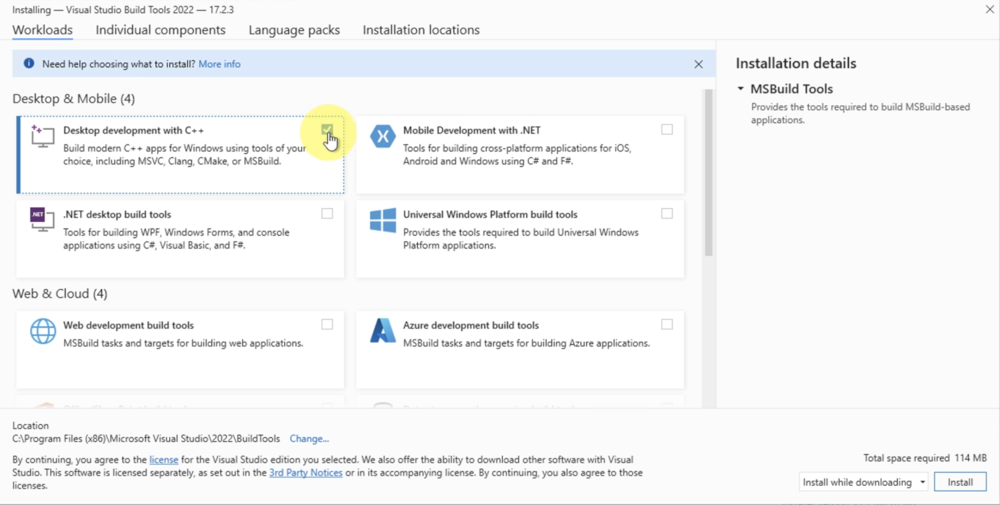
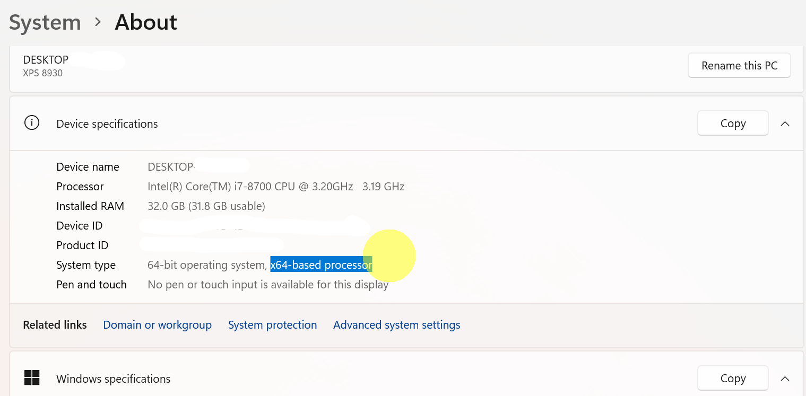
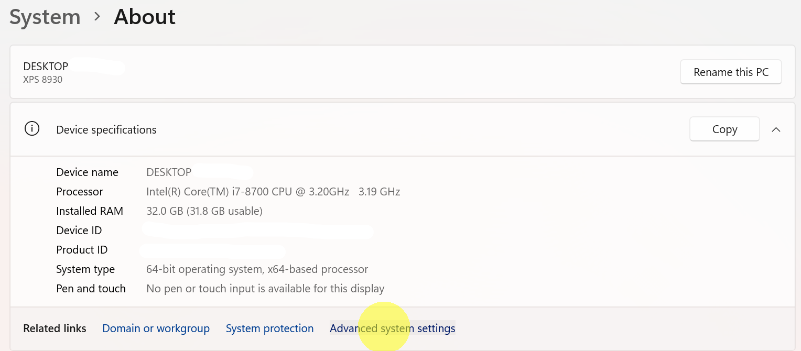
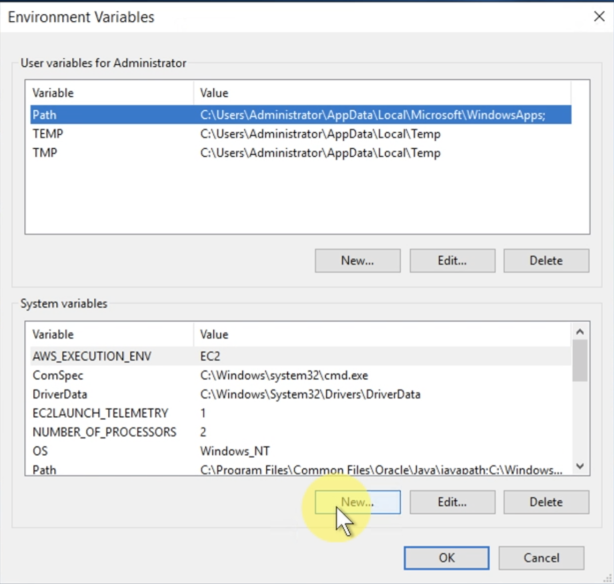
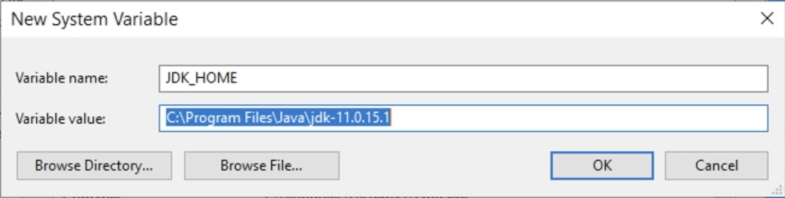
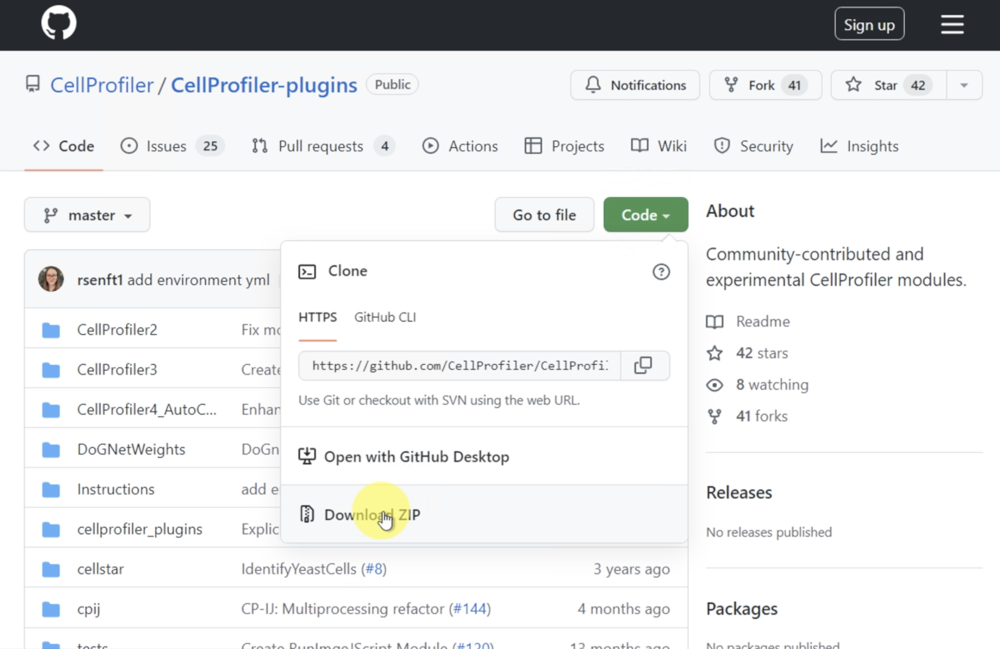
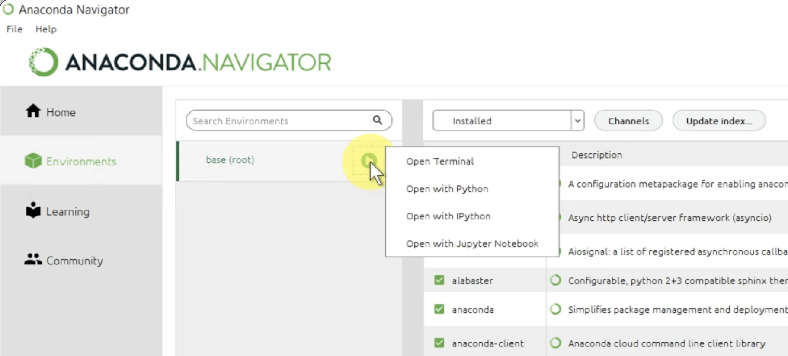
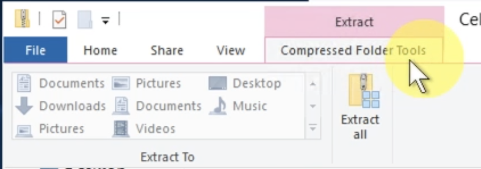

# How to install CellProfiler from source with all plugins on Windows

Some of these download steps can take a while. The first 3 steps (as well as downloading Anaconda) can all be done simultaneously to save you time.

1. **Download and install [Microsoft Visual Studio C++ build tools](https://visualstudio.microsoft.com/visual-cpp-build-tools/)**

   **NOTE**: Make sure to check 'Desktop development with C++' under Desktop and Mobile in the installer:

   

2. **Download and install [Microsoft Visual C++ Redistributable 2015-2022]( https://docs.microsoft.com/en-us/cpp/windows/latest-supported-vc-redist?view=msvc-170)**

   You may already have this installed on your computer. 

   Select the version appropriate for your architecture. On windows, you can determine this by going to **Control Panel** then searching for **System** and looking next to "System type:" for your processor architecture. Below is an example image:
   
   


3. **Download and install [Java JDK 11](https://adoptopenjdk.net/)**
   
   You can alternatively install from [oracle.com](https://www.oracle.com/java/technologies/javase-jdk11-downloads.html) if you'd like, though you will need to make an Oracle account. 

4. **Update your Windows Environment Variables for Java**

    Go to **Control Panel** then search for **System**, then click on **Advanced System Settings**
    

    From the System Properties window that pops up, select **Environment Variables...** Then add a new System variable by selecting **New...** under 'System Variables':

   

    Add (or if you already have it, modify) two system variables: `JAVA_HOME` and `JDK_HOME`. For each new variable, set its value to the location of your JDK installation (i.e., the location of the folder beginning with 'jdk11'). You can do this by clicking the **Browse Directory...** button. Usually this is in your 'Program Files' in a folder called 'Java'. Here is an example path:

   


5. **Download and install or update conda**

   For beginners, we recommend you use Anaconda Navigator since it is more beginner-friendly, but you can also use miniconda. [Download Anaconda](https://www.anaconda.com/products/distribution) from the website and install.

   **NOTE**: if you already have conda, you can get the command to update conda by typing `conda update` on your command line. The command will generally look like:

   `conda update --prefix /Users/USERNAME/opt/anaconda3 anaconda`


6. **Download the environment file [CellProfiler_plugins_windows.yml](https://github.com/CellProfiler/CellProfiler-plugins/blob/master/Instructions/cellprofiler_plugins_windows.yml)**

   You can download the whole repo by cloning it with git or simply clicking the green **Code** button on [the repo page](https://github.com/CellProfiler/CellProfiler-plugins.git) and selecting **Download ZIP** (see below) and then extract the ZIP folder contents. The environment file is in the `Instructions` subfolder.

   Alternatively, you can copy and paste the contents of the .yml file into a text editor like Notepad. If you do this, make sure you save it as "CellProfiler_plugins_windows.yml" and as type "All Files" and **NOT** "Text file".

   

7. **Create the environment from the .yml file**

   Open Anaconda Navigator and select the **Environments** tab on the left. We recommend you create the environment from the command line. To do this, Select the play button next to your base (root) environment and select **Open Terminal**:

   

   In the terminal, navigate to where your environment file is located with `cd PATH_TO_FOLDER` where `PATH_TO_FOLDER` is the path to the directory containing your yml file (e.g., `C:/Users/USER/Desktop`).

   Then in the terminal window that pops up, enter the following command:
   ```
   conda env create -f CellProfiler_plugins_windows.yml
   ```

8. **Activate your environment**

   In your terminal, enter `conda activate Cellprofiler_plugins` to activate your environment

9. **Verify that cellprofiler is installed correctly by running it from the command line.**

   In your terminal, type in `cellprofiler` and hit Enter. this will open CellProfiler or will give you an error message.

10. **Install other packages for other plugins (just for RunStarDist)**

    In terminal with your environment activated, enter:
    ```
    pip install stardist csbdeep --no-deps
    ```
    If you would like to use the omnipose models in cellpose, ensure you have cellpose 1.0.2 (you should by default if you've used our environment yml) and enter on the command line (in your activated environment):
    ```
    pip install omnipose
    ```

11. **Clone the CellProfiler-plugins Repo**

    If you have not already downloaded the repo, download it from [here](https://github.com/CellProfiler/CellProfiler-plugins.git). If you download the ZIP file, be sure to extract the file contents by selecting **Extract All** in File Explorer:

    

    You can also use git or GitHub Desktop to clone the repo if you prefer.

12. **Connect CellProfiler and the plugins repo**

    With your environment active, type `cellprofiler` in terminal to open CellProfiler if it is not open already.

    * In CellProfiler, go to **File** then **Preferences...**
    * Scroll down and look for "CellProfiler Plugins Directory" on the left.
    * Select the **Browse** button and choose the folder where you extracted the CellProfiler plugins files. It is probably called "CellProfiler-plugins-master" unless you have renamed it.
    * Select **Save** at the bottom of the Preferences window
    * Close CellProfiler and reopen it by typing `cellprofiler` on the command line


    **NOTE**: You might get a warning like this:
    ```
    W tensorflow/stream_executor/platform/default/dso_loader.cc:64] Could not load dynamic library 'cudart64_110.dll'; dlerror: cudart64_110.dll not found
    2022-05-26 20:24:21.906286: I tensorflow/stream_executor/cuda/cudart_stub.cc:29] Ignore above cudart dlerror if you do not have a GPU set up on your machine.
    ```
    If you don't have a GPU, this is not a problem. If you do, your configuration is incorrect and you need to try reinstalling drivers and the correct version of CUDA for your system.

13. **Verify that the installation worked**

    Add a module to your pipeline by hitting the **+** button in the pipeline panel (bottom left)

    In the "Add Modules" window that pops up, type "run" into the search bar. You should be able to see plugins like RunCellpose and RunStarDist if the installation was successful:
    
    

---

## Common errors

1. My wheels are failing to build

    - If you get a message like "ERROR: Failed building wheel for pyzmq" this usually means that you do not have the Microsoft Visual Studio tools installed properly or the wrong version of pyzmq is being installed (e.g., you have a previous version already installed in your environment). See Step #1-2 above and ensure that you have "Desktop development with C++" selected under the install configuration options


2. Java virtual machine cannot be found. This error might look something like `javabridge.jutil.JVMNotFoundError`

    - If you're getting errors about Java, it means that java is not being configured properly on your system.
    - Make sure you have installed The Java Development Kit 11. Note that newer versions of Java may not work.
    - Make sure you've added environment variables at the **System** level and not at the **User** level. You need to add both `JAVA_HOME` and `JDK_HOME` and both need to point to the folder that holds your jdk installation. Typically this path would look something like `C:\Program Files\Java\jdk-11.0.15.1` but it might be different on your machine depending on where you've installed Java.
    - If you have done these things and you still get this error, then try `pip install javabridge` (inside your activated cellprofiler-plugins conda environment) and then opening cellprofiler with `cellprofiler`


3. Installing pyzmq failed

    You might get an error when trying to install pyzmq. Something like
    ```
    ERROR: Command errored out with exit status 1:
    ```
    And earlier in the traceback:
    ```
    Fatal: Cython-generated file 'zmq\backend\cython\_device.c' not found.
                      Cython >= 0.20 is required to compile pyzmq from a development branch.
                      Please install Cython or download a release package of pyzmq.
    ```

      To fix this, activate your environment and then `conda install cython`       

    - You might also get an error like:
    ```
    AttributeError: 'MSVCCompiler' object has no attribute '_vcruntime_redist'
    ```

    Generally, this error means that you don't have the right Microsoft Visual Studio C compiler. You can try two things:

    1. Look below in the code. Even if the wheel fails, pyzmq will still attempt to install. Look below for `Running setup.py install for pyzmq ... done` Also make sure you don't have any additional versions of pyzmq installed already.
    2. You can try reinstalling Microsoft Visual C++ Build tools (#1-2). Versions 2008, 2015-2022 should work. Make sure you have the version of the redistributable compatible with your system processor (see step #2).

---
