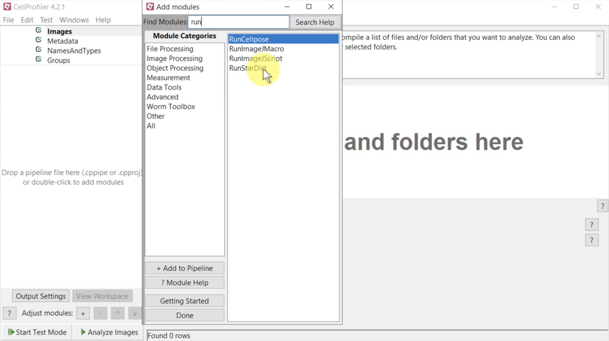

 Installation instructions for CellProfiler + plugins using a conda environment on Macs using the new Apple M1/2 processor. 


 Install CellProfiler inside a conda environment
   - For less conflict problems, it is recommended to follow the conda installation


1. **Install brew**
    ```
    /bin/bash -c "$(curl -fsSL https://raw.githubusercontent.com/Homebrew/install/HEAD/install.sh)"
    ```

2. **Update brew**
    ```
    brew update
    ```
    
3. **Install Java**
    ```
    brew install java
    ```

4. **For the system Java wrappers to find this JDK, symlink it with**
    ```
    sudo ln -sfn /opt/homebrew/opt/openjdk/libexec/openjdk.jdk /Library/Java/JavaVirtualMachines/openjdk.jdk
    ```

5. **Set version in zshrc**
    ```
    echo export JAVA_HOME=$(/usr/libexec/java_home -v 1.8) >> ~/.zshrc
    source ~/.zshrc
    ```

6. **Brew install the packages req**
    ```
    brew install freetype mysql git
    ```

7. **Direct to brew openssl**
    ```
    export LDFLAGS="-L$(brew --prefix)/opt/openssl/lib"
    ```

8. **Install hdf5**
    ```
    brew install hdf5@1.12
    ```

9. **Make sure to get the version directory correct for the version of HDF5 installed**
    ```
    export HDF5_DIR=$(ls /opt/homebrew/Cellar/hdf5/)
    ```
10. **Create a folder and download cellprofiler, cellprofiler-core, cellprofiler-plugins and wxPython**

    ```
    mkdir cp_plugins
    cd cp_plugins
    git clone https://github.com/CellProfiler/core
    git clone https://github.com/CellProfiler/CellProfiler
    git clone https://github.com/CellProfiler/CellProfiler-plugins
    ```

11. Download dev build of wxPython here: https://wxpython.org/Phoenix/snapshot-builds/
12. Download the latest build with the filename format: wxPython-4.1.2a1.devXXXX+XXXXXXXX.tar.gz
      - Ignore the `.whl` files
13. Then, extract wxPython.

14. **Modify the **setup.py** in the cloned CellProfiler repo.**


   - Comment out cellprofiler-core and wxpython from the **install_requires** section, since we are installing our own versions from source:

    ```
    ...
    "boto3>=1.12.28",
    # "cellprofiler-core==4.2.1",
    "centrosome==1.2.0",
    ...
    "six",
    # "wxPython==4.1.0",
    ```

15. **Download and install miniconda**

   ```
    wget https://repo.anaconda.com/miniconda/Miniconda3-latest-MacOSX-arm64.sh -O ~/miniconda.sh
   ```


16. **Create a conda environment using the cellprofiler_plugins_macM1.yml file**

    At this stage, your folder/file structure should look like this:

    ```
    ├── cp_plugins
        ├── CellProfiler/
        ├── CellProfiler-plugins
        ├── wxPython-4.2.0a1.dev5470+b33b012b/
        ├── wxPython-4.2.0a1.dev5470+b33b012b.tar.gz
        ├── core
        └── cpcellpose2.yml

    ```

    In the terminal, make sure you are in the `cp_plugins` folder mentioned above.

    ```
    conda env create -n cp_plugins --file cellprofiler_plugins_macM1.yml
    ```

17. **Activate the conda environment**

    ```
    conda activate cp_plugins
    ```

18. **Install wxPython, core and cellprofiler**

    In the terminal with your environment activate, navigate to the folder where you download the softwares and enter:

    Remeber to change the wxPython-name to mach your folder.
        
    ```
    pip install ./wxPython-4.2.1a1.dev5486+98871b69 
    pip install ./core
    pip install ./CellProfiler
    ```

19. **Resolving dependencies conflits**

    In the terminal with your environment activate, enter:
    ```
    pip uninstall -y centrosome python-javabridge
    pip install --no-cache-dir --no-deps --no-build-isolation python-javabridge centrosome
    pip uninstall matplotlib -y
    pip install matplotlib==3.2
    pip uninstall mahotas -y
    pip install mahotas
    ```

20. **Install other packages for other plugins (just for runStardist)**

    In the terminal with your environment activate, enter:
    ```
    conda install -c apple tensorflow-deps
    python -m pip install tensorflow-macos
    pip install stardist csbdeep --no-deps
    ```

21. **Open CellProfiler**
    - Execute this command from within the downloaded CellProfiler repo (get there with `cd CellProfiler`)

    ```
    pythonw -m cellprofiler
    ```

22. **Connect CellProfiler and the plugins repo**

    With your environment active, type pythonw -m cellprofiler in terminal to open CellProfiler if it is not open already.

    *In CellProfiler, go to File then Preferences...
    *Scroll down and look for "CellProfiler Plugins Directory" on the left.
    *Select the Browse button and choose the folder where you extracted the CellProfiler plugins files. It is probably called "CellProfiler-plugins-master" unless you have renamed it.
    *Select Save at the bottom of the Preferences window
    *Close CellProfiler and reopen it by typing pythonw -m cellprofiler on the command line

23. **Verify that the installation worked**

    - Execute this command from within the downloaded CellProfiler repo (get there with `cd CellProfiler`)

    ```
    pythonw -m cellprofiler
    ```

Add a module to your pipeline by hitting the **+** button in the pipeline panel (bottom left)

In the "Add Modules" window that pops up, type "run" into the search bar. You should be able to see plugins like RunCellpose and RunStarDist if the installation was successful:
