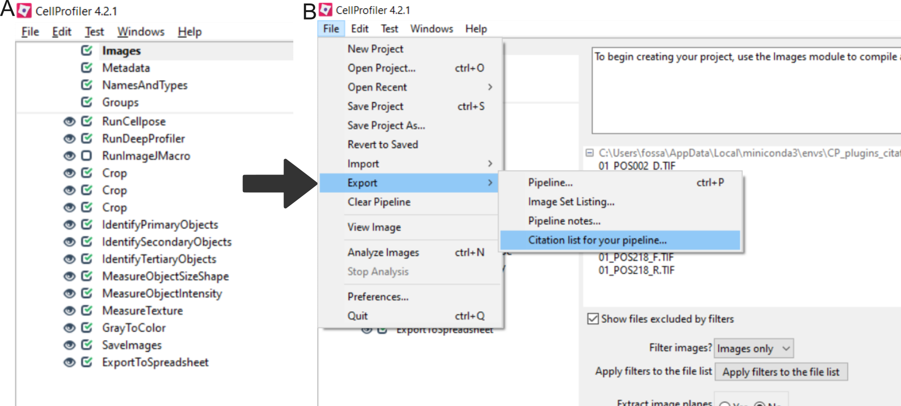

# Citing CellProfiler Plugins

If using CellProfiler Plugins in a pipeline used in a publication, please cite our CellProfiler Plugins paper:

ENTER CITATION

Additionally, some plugins require citation themselves if used.
You can determine which plugins require citation by reading the Help information for each plugin, accessible through CellProfiler, or by using the Citation generator built into CellProfiler (since CellProfiler 5).

Figure 1: How to use the citation tool. To use CellProfiler's citation generator, load your pipeline into CellProfiler (A). Navigate to File => Export => Citation (B). If the module is disabled, it still generates the citation but with the disabled tag. 

Please note that many CellProfiler modules (including plugins) provide references that offer further information/background about the processing happening within the module.
You may wish to read the references and cite any that upon which your analyses are particularly dependent.
However, please do note that `References` and `Citations` are separate and citing module references is not required.